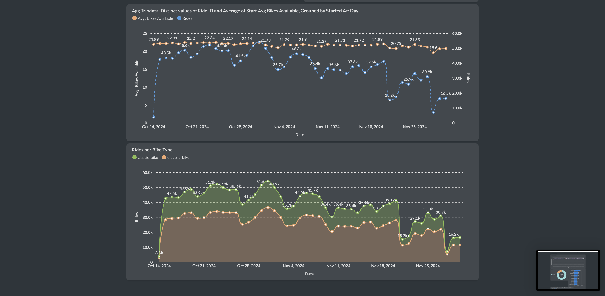

**Overview**

Data project to stream and batch citibike-nyc data locally using open source solutions


[**Set up Infrastructure - Docker Compose**](https://github.com/Otobi1/citibike-stream/blob/master/docker-compose.yml)
```
Provision and manage
- zookeeper & kafka
- postgres
- spark
- metabase
```

**Ingest Data into Postgres DB**

[**Trips**](https://github.com/Otobi1/citibike-stream/blob/master/python_app/download_tripdata.py)
> Ingest partitioned trips data October and November 2024 into Postgres DB. 

[**Station Status**](https://github.com/Otobi1/citibike-stream/blob/master/python_app/station_status_to_postgres.py)
> Stream station status data per minute into Postgres DB

[**Station Information**](https://github.com/Otobi1/citibike-stream/blob/master/python_app/station_information_to_postgres.py)
> Ingest station information (metadata) data per day into Postgres DB

[**Data Processing - Spark**](https://github.com/Otobi1/citibike-stream/blob/master/python_app/transform_tripdata.py)
> - Connect Station Status and Station Information to enrich station status with the meta information - write enriched table to the Postgres DB
> - Join the enriched station status with the trips data to get the total number of trips per day and other metrics - write the result to the Postgres DB


**Outcome**
> * Explored data streaming and batch processing using open source solutions locally.
> * Learnt the use of docker-compose to manage and connect multiple services.

**Dashboard - Metabase**

